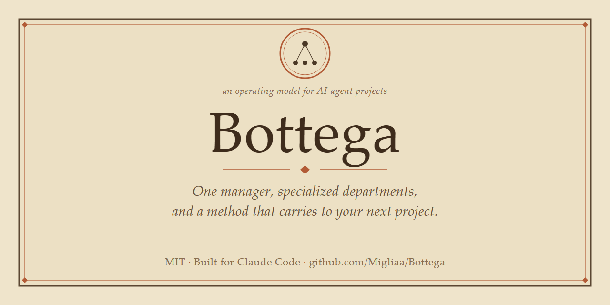

# Bottega

> **An open, project-agnostic operating model for running real projects as a small company of AI agents — one manager, specialized departments, and a method that carries over to your next project.**

[](LICENSE)
[](https://claude.com/claude-code)
[](#)



**Bottega** is a reusable way to organize work with [Claude Code](https://claude.com/claude-code) (and similar agentic coding tools): instead of one chat that forgets your conventions every time, you run a **manager agent** that plans and commits, a set of **department agents** that execute in their own lane, and a lightweight **file protocol** that keeps them in sync — all driven by you, the **committente** (the patron who commissions the work).

You set it up once. The method, the roles, the guardrails, and the launch commands are all written down — so your **next** project starts from a trained organization, not from a blank prompt.

---

## Table of contents

- [What is Bottega](#what-is-bottega)
- [The problem it solves](#the-problem-it-solves)
- [The model in one picture](#the-model-in-one-picture)
- [How it works (the cycle)](#how-it-works-the-cycle)
- [Quickstart](#quickstart)
- [Repository structure](#repository-structure)
- [Who is this for](#who-is-this-for)
- [FAQ](#faq)
- [Design principles](#design-principles)
- [Glossary](#glossary)
- [Contributing](#contributing)
- [License](#license)

---

## What is Bottega

Bottega is a **multi-agent operating model** — a documented method plus a set of copy-and-fill templates — for steering a software or creative project run mostly by AI agents.

It is named after the Renaissance **bottega**: a workshop where a *capobottega* (master) directed *garzoni* and apprentices with defined roles, all working on commission for a **committente** (patron). That vocabulary maps the system exactly:

| Renaissance bottega | Bottega framework |
|---|---|
| Committente (patron) | **You** — decide strategy, launch the sessions, approve |
| Capobottega (master) | The **manager** agent: plans, decides, commits |
| Garzoni / apprentices | The **department** agents: execute in their lane |
| The workshop's method | The **process constitution** + interface protocol |

Bottega is **tool-agnostic in spirit** but ships ready for **Claude Code**: department sessions, slash-command launchers, persistent agent memory, and a git-native commit discipline.

## The problem it solves

A single long agent chat has three failure modes Bottega is designed to remove:

1. **Amnesia between projects.** You re-teach the agent your roles, conventions, and guardrails every time. Bottega writes them down once as reusable templates.
2. **One context doing everything.** Planning, implementation, QA, research, and compliance fight for the same window and step on each other. Bottega splits them into **separate sessions with clear mandates**.
3. **Silent drift and lost work.** No record of decisions, no commit discipline, secrets leaking into commits. Bottega makes **one agent commit**, state live in files, and guardrails explicit.

## The model in one picture

```
   COMMITTENTE  (you, human) — the patron
   decides strategy & price · launches sessions · approves
         │   ↕ a real two-way conversation
   MANAGER  (Opus) — "il capobottega"
   plans Macro→Sub→Micro · triages · writes sprints · the ONLY one who commits
         │
         │   everything below is file-mediated — git is the bus, you just trigger the sessions
         │
   ├─▶ EXECUTION (operative, disposable) ── via Sprint.md work-order + Execution Record (no mailbox)
   ├─▶ VALIDATION ┐
   ├─▶ RESEARCH   │  persistent departments — each with its OWN INTERFACE.md
   ├─▶ PUBLISHING │  (Digest · From Manager · From Department)
   └─▶ COMPLIANCE ┘  … pick the departments you need
```

Sessions **don't talk to each other directly**, and **you don't carry their messages**. The *content* flows through **git files** (`INTERFACE.md`, `Sprint.md`, `ActualStatus.md`) — those files are the **bus**. You just **trigger** the sessions (launch them so they read and write those files) and make the decisions. That's what lets the organization survive a closed laptop, a crashed session, or a new teammate.

## How it works (the cycle)

1. **You go to the manager** when you need a decision, want to plan a step, or have a department's output to triage.
2. **The manager plans** — it decomposes work into sprints and writes a **work-order**, updating `Sprint.md` and `ActualStatus.md`.
3. **You launch the right department session** with a slash command (e.g. `/lancia-operativa <work-order>`).
4. That session works in its lane and **hands an output back to you**; you relay it to the manager.
5. **The manager triages, updates the files, and commits** to `main` (only the manager commits).

Repeat. The files are always the source of truth, so any session can be reconstructed from disk.

## Quickstart

> Prerequisite: [Claude Code](https://claude.com/claude-code) and a git repository for **your** project (not this one).

### Two folders (read this first — it's the part people trip on)

You deal with **two** folders, and they're not the same:

1. **The Bottega framework** — *this* repo. You clone it once; it's the box of templates. You never run the manager inside it.
2. **Your project** — where you actually work. Bottega gets *installed into it* by the manager, guided by you. You point the manager at the framework clone to read the templates.

### Step by step

**1. Clone the framework once** (anywhere — it's just the template box):

```
git clone https://github.com/Migliaa/Bottega.git
```

**2. Create your project folder and make it a git repo.** Run these **one line at a time** — don't chain them with `&&` (Windows PowerShell and some shells reject that operator):

```
mkdir my-project
cd my-project
git init
```

**3. Open a Claude Code session *inside* `my-project`.** This is the *rooting* rule: the session must live in your project folder, or its slash commands and file reads won't resolve.

**4. Start the setup by pasting the bootstrap prompt.** Open `Bottega/templates/commands/bootstrap.md`, copy its whole contents, paste it as your first message, and add one line: *"the Bottega clone is at `../Bottega`"* (point it at wherever you cloned it in step 1).

> Why paste instead of typing a command? A slash command has to be *installed* before you can call it — a chicken-and-egg on a brand-new project. Pasting the prompt skips that. *(Want the reusable `/bootstrap` command for next time? Copy that one file into `my-project/.claude/commands/`, then you can type `/bootstrap ../Bottega` instead of pasting.)*

**5. Answer the interview.** The manager asks what the project is, which departments you need, what must stay secret, public or private, etc. — then **generates your filled-in files** (`CLAUDE.md`, the cockpit, sprints, commands, departments, memory seeds) and shows you the diff before saving.

**6. Open the workshop:** run `/lancia-org` to start the manager. From here, your manual is **[`tutorials/human-quickstart.md`](tutorials/human-quickstart.md)**.

### Prefer to set it up entirely by hand?

1. Copy `templates/` into your project and rename the `*.template` files (drop the suffix).
2. Fill the placeholders (`{{PROJECT_NAME}}`, `{{REPO_URL}}`, `{{SECRETS_GLOB}}`, `{{IP_TO_PROTECT}}`, `{{DEPARTMENTS}}`, …) — all listed in `templates/bottega.config.md`.
3. Put `CLAUDE.md` and `commands/` in place; seed the manager's `memory/`.
4. Open a session rooted in your project and run `/lancia-org`.

## Repository structure

| Path | What it is |
|---|---|
| [`docs/`](docs/) | **The method, explained.** Read these to understand the model. |
| [`docs/01-overview.md`](docs/01-overview.md) | The model: manager + departments + git-files-as-the-bus |
| [`docs/02-the-method.md`](docs/02-the-method.md) | The work cycle, the 3-level sprints, gates |
| [`docs/03-roles.md`](docs/03-roles.md) | Each role's mandate and boundaries |
| [`docs/04-interface-protocol.md`](docs/04-interface-protocol.md) | The `INTERFACE.md` async mailbox spec |
| [`docs/05-constraints.md`](docs/05-constraints.md) | The guardrail pattern (secrets, commits, IP, rooting) |
| [`docs/06-agentic-governance.md`](docs/06-agentic-governance.md) | When and how to give an automation autonomy |
| [`docs/07-glossary.md`](docs/07-glossary.md) | The shared vocabulary |
| [`templates/`](templates/) | **Copy these into your project and fill the placeholders.** |
| [`templates/CLAUDE.md.template`](templates/CLAUDE.md.template) | The process constitution that makes the manager behave |
| [`templates/commands/`](templates/commands/) | The slash-command session launchers (incl. `/bootstrap`) |
| [`departments/`](departments/) | **Ready-made recipes** for the common department archetypes |
| [`tutorials/`](tutorials/) | **Manuals:** human quickstart, bootstrap a new project, troubleshooting |
| [`examples/`](examples/) | A tiny, fully filled-in example instance |

## Who is this for

- **Solo builders & indie hackers** running ambitious projects with AI agents who don't want to re-explain their process every time.
- **Small teams** that want a shared, version-controlled way of working with coding agents.
- **Anyone using Claude Code** for multi-step work who has felt one chat is doing too much.

## FAQ

**Is Bottega a piece of software I install?**
No. It's an **operating model**: documentation plus copy-and-fill templates (Markdown + slash commands). There's nothing to `npm install`. You adopt the method and the files.

**Does it only work with Claude Code?**
It's optimized for Claude Code (sessions, slash commands, agent memory, git-native commits). The *model* — a manager, departments, an async file protocol, explicit guardrails — transfers to any capable agentic tool; you'd adapt the launch mechanics.

**Do I need multiple paid agents running at once?**
No. Sessions run **one at a time**; you (the committente) carry messages between them. Bottega is a coordination *method*, not a server.

**How is this different from just prompting an agent well?**
A good prompt dies with the chat. Bottega externalizes the prompt into **roles, a process constitution, an interface protocol, and launch commands** that persist in git and carry to the next project.

**What's a "committente"?**
The Italian word for the patron who commissions work from a workshop. In Bottega it's **you**: you decide strategy and **trigger** the sessions; the **git files** are the bus, not you. See the [glossary](docs/07-glossary.md).

**Can I add my own departments?**
Yes. Use [`templates/department-charter.md.template`](templates/department-charter.md.template) and the recipes in [`departments/`](departments/). Departments are configured per project.

**Is my proprietary work safe?**
Guardrails are first-class: a designated **IP-to-protect** never leaves the private repo, secret files are never committed, and only the manager commits. See [`docs/05-constraints.md`](docs/05-constraints.md).

## Design principles

1. **State lives in files, not in context.** Any session is reconstructable from disk.
2. **One manager commits.** Departments work scoped to their own folder; the manager owns `main`.
3. **Separate the lane, separate the session.** Planning, execution, QA, research, compliance don't share a window.
4. **Async by file, not by memory.** The `INTERFACE.md` protocol means nobody has to *remember* to update anybody.
5. **Guardrails are explicit and boring.** Secrets, commit policy, and the IP-to-protect are written down, not assumed.
6. **The simplest structure that works.** Start with a manager + one execution lane; add departments only when a lane is genuinely overloaded.

## Glossary

Key terms — *committente, manager, department, sprint, micro, work-order, gate, INTERFACE* — are defined in [`docs/07-glossary.md`](docs/07-glossary.md).

## Contributing

Bottega is a **living framework**. Issues and pull requests that generalize a useful pattern (a new department recipe, a clearer template, a better tutorial) are welcome. See [`CONTRIBUTING.md`](CONTRIBUTING.md).

> **Tip for maintainers:** add GitHub *topics* to this repo for discoverability — e.g. `claude-code`, `ai-agents`, `multi-agent`, `agent-orchestration`, `agentic-workflow`, `ai-project-management`, `llm`, `framework`, `template`.

## License

[MIT](LICENSE) © 2026 Andrea Migliavacca. Use it, fork it, adapt it, share it.
